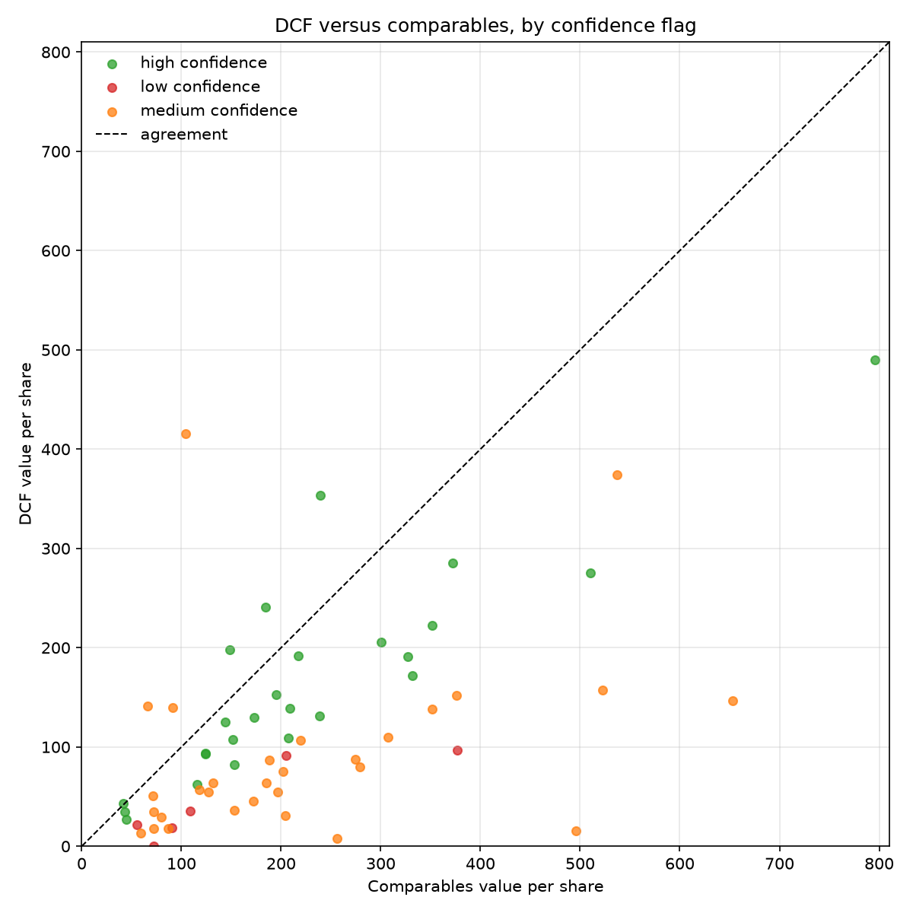
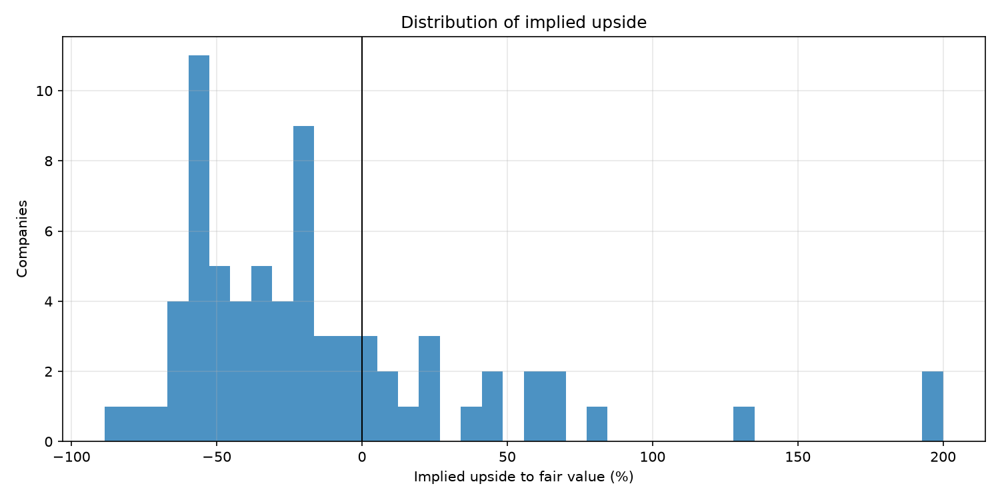

# Equity Valuation Engine

An automated fundamental valuation framework covering the S&P 500. Pulls financial statement data, builds a discounted cash flow model and a comparables screen for each name, and outputs a ranked valuation table.

## What It Does

Sell-side style valuation is usually done one company at a time. This runs the same process across the full index so relative dislocations are visible in one view. Every company gets a DCF, a multiples-based comparable valuation, and a blended fair value estimate with the assumptions recorded.

## Model Components

**Discounted cash flow**
- Free cash flow to firm projected over an explicit forecast horizon
- Revenue growth from trailing realized growth, damped toward a terminal rate
- WACC built from a CAPM cost of equity and observed cost of debt
- Terminal value via perpetuity growth, with a multiple-based cross-check

**Comparables**
- Peers grouped by sector and size
- EV/EBITDA, EV/Sales, P/E, and P/B against the peer median
- Outliers trimmed before computing peer statistics

**Blend**
- Weighted combination of DCF and comparable estimates
- Output includes implied upside or downside against current price

## Sensitivity

DCF output is dominated by two inputs: the discount rate and the terminal growth rate. The engine produces a sensitivity grid across both for every name rather than reporting a single point estimate, because a point estimate from a DCF conveys false precision.

## Repository Layout

```
equity-valuation-engine/
|
|-- README.md
|-- LICENSE
|-- .gitignore
|-- requirements.txt
|
|-- src/
|   |-- __init__.py
|   |-- comps.py
|   |-- dcf.py
|   |-- report.py
|   `-- wacc.py
|
|-- models/
|   |-- __init__.py
|   |-- blended_model.py
|   |-- comps_model.py
|   `-- dcf_model.py
|
|-- docs/
|   |-- methodology.md
|   `-- roadmap.md
|
|-- results/
|   `-- .gitkeep
|
|-- tests/
|   |-- __init__.py
|   |-- test_comps.py
|   `-- test_dcf.py
```

## Setup

```bash
python -m venv .venv
source .venv/bin/activate
pip install -r requirements.txt
```

API credentials are read from environment variables and are never committed.

## Usage

Reproduce every published number with one command:

```bash
python run_results.py
```

This pulls statement data and prices from Yahoo Finance, caches both to
`cache/`, estimates beta, values every company by DCF and comparables, and
writes `results/valuations.csv`, `results/summary.md`, and the figures under
`docs/images/`.

Verify the pipeline without a network first:

```bash
python run_results.py --offline
```

Override the macro assumptions:

```bash
python run_results.py --risk-free 0.045 --erp 0.05 --dcf-weight 0.5
```

All settings live in `config.py`. The fundamentals cache is the slow part;
delete it to refresh.

## Tests

```bash
python -m pytest tests -q
```

23 tests covering DCF mechanics, sensitivity spread, peer selection, and confidence flagging.

## Results

Reproduce with `python run_results.py`. Full output for all 71 companies is in
[results/valuations.csv](results/valuations.csv), and every run parameter is in
[results/summary.md](results/summary.md).

**This is a screen, not a set of price targets.** Identical projection logic is
applied to businesses with very different cash flow profiles, so the extremes
of the ranking are as likely to be modelling artifacts as opportunities. The
confidence column exists to say where the model does not trust itself.

### Highest implied upside

| | Sector | Price | DCF | Comps | Fair value | Upside | WACC | Beta | Confidence |
|---|---|---|---|---|---|---|---|---|---|
| VLO | Energy | 312.98 | 874.44 | 489.70 | 720.55 | 130.2% | 7.6% | 0.71 | medium |
| NEM | Basic Materials | 93.71 | 139.13 | 209.07 | 167.10 | 78.3% | 7.5% | 0.66 | high |
| HCA | Healthcare | 402.58 | 459.04 | 1022.50 | 684.42 | 70.0% | 7.6% | 1.07 | medium |
| REGN | Healthcare | 762.63 | 1410.74 | 1110.53 | 1290.66 | 69.2% | 6.6% | 0.46 | high |
| D | Utilities | 69.20 | 140.93 | 66.46 | 111.14 | 60.6% | 6.5% | 0.77 | medium |
| PEG | Utilities | 76.68 | 139.41 | 91.45 | 120.22 | 56.8% | 6.5% | 0.67 | medium |
| EOG | Energy | 148.66 | 240.51 | 184.48 | 218.10 | 46.7% | 6.7% | 0.52 | high |
| NVDA | Technology | 200.75 | 415.92 | 104.08 | 291.18 | 45.0% | 14.1% | 1.81 | medium |
| ACN | Technology | 165.92 | 137.78 | 351.68 | 223.34 | 34.6% | 9.5% | 1.06 | medium |
| HON | Industrials | 243.05 | 157.34 | 522.84 | 303.54 | 24.9% | 7.4% | 0.91 | medium |

| Confidence | Companies |
|---|---|
| high | 26 |
| medium | 35 |
| low | 10 |





### The two methods disagree systematically

The most useful output of this engine is not the ranking. It is the scatter.

**The DCF sits below the comparables value for 55 of the 64 companies where
both methods produce a number, and the median DCF is 0.50x the median comps
value.** An 86% one-sided split is not noise. It is a property of the
assumptions, and the dominant one is the 40% reinvestment rate: charging 40% of
NOPAT to reinvestment every year for ten years suppresses free cash flow
relative to what the market is capitalising.

The consequence shows up in the upside distribution, where the median company
screens 24% overvalued and 73% screen negative. A model that calls three
quarters of the largest US companies overvalued is more likely to be
mis-specified than prescient. The correct reading is that this configuration
carries a systematic bearish bias, and the ranking is meaningful only
*relative* within itself, not as an absolute statement about value.

**Disagreement is also large case by case.** 34 of 64 companies show the two
methods differing by more than 2x in one direction or the other. CVS is the
extreme: a DCF of 7.83 against a comps value of 255.91, blended to 107.06 and a
tidy-looking 2.5% upside. The blend manufactures a plausible number out of two
numbers that share nothing. That is a structural weakness of blending, and the
`dcf_vs_comps_gap` column exists to expose it.

### Coverage is the binding constraint

Of 100 companies attempted, **29 were dropped for missing or invalid statement
data**, 4 more produced a non-positive DCF and were excluded from the ranking,
and 3 could not form a peer group of the required minimum size. Free
fundamentals data is the limiting factor here, not the valuation logic, and no
amount of modelling improves it.

The 15 companies sitting exactly at the 6.5% WACC floor are also worth noting.
For those names the discount rate is imposed rather than estimated, which is
why the floor is stated in the run parameters rather than buried in code.

## Limitations

- **Systematic bearish bias.** The DCF is below comps for 86% of companies and
  the median company screens 24% overvalued. The 40% reinvestment rate is the
  main driver. Results are meaningful as a relative ranking, not as absolute
  value.
- **Data coverage.** 29 of 100 companies dropped for incomplete statement data
  from the free source. Coverage, not method, is the binding constraint.
- **Uniform assumptions across heterogeneous businesses.** One reinvestment
  rate, one terminal growth rate, and one forecast shape applied to utilities
  and semiconductor firms alike.
- **The blend can mask total disagreement.** Averaging a DCF of 7.83 with a
  comps value of 255.91 yields a number that looks reasonable and means
  nothing. Read `dcf_vs_comps_gap`, not just `fair_value`.
- **Companies with no peer group are ranked on the DCF alone.** Communication
  Services has too few names in this universe to form the minimum peer set, so
  GOOGL and META carry a DCF-only fair value despite appearing in the blended
  table.
- **WACC floor is a judgment call.** 15 companies sit exactly at 6.5%, where
  the discount rate is imposed rather than estimated.
- **Sector fit.** The FCFF model does not describe Financials or Real Estate.
  Those sectors are retained and demoted by the confidence flag rather than
  silently excluded.
- **Point in time only.** This is a snapshot with no backtest, so there is no
  evidence that the screen predicts returns.

## License

MIT

---

*Research code. Not investment advice.*
